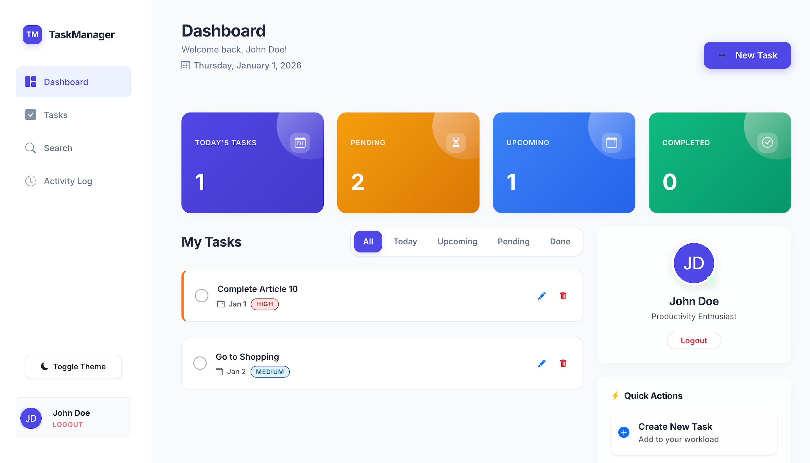

# Task Management System

A professional, full-stack Task Management application built with **Node.js**, **Express**, **MySQL**, and **EJS**.  
Designed to help individuals and teams organize work, track progress, and amplify results with a beautiful "Glassmorphism" UI.



## 🚀 Features

### 🌟 Core Experience
- **Landing Page**: A dedicated, high-conversion landing page for unauthenticated users.
- **Smart Dashboard**: Real-time overview of tasks with **Total**, **Pending**, **Upcoming**, and **Completed** statistics.
- **Glassmorphism UI**: A consistent, modern design language featuring semi-transparent panels, blur effects, and smooth gradients.
- **Dark Mode Support**: Fully optimized for both light and dark themes.

### ✅ Task Management
- **CRUD Operations**: Create, Read, Update, and Delete tasks effortlessly.
- **Subtasks**: Break down complex tasks into manageable sub-steps.
- **Priorities & Due Dates**: Set priority levels (High, Medium, Low) and deadlines to stay on track.
- **Filters**: Quickly filter tasks by status (Today, Upcoming, Pending, Completed).

### 📊 Activity & Insights
- **Activity Log**: A visual vertical timeline tracking every action (Task creation, updates, deletions, comments).
- **Comments**: context-aware commenting system for every task.
- **Analytics**: Visual insights into productivity trends (optional integration).

### 🔒 Security
- **Authentication**: Secure user registration and login using `bcrypt` password hashing.
- **Session Management**: Persistent user sessions with `express-session`.
- **Protected Routes**: Middleware ensures sensitive pages are only accessible to authenticated users.

## 🛠️ Tech Stack

- **Backend**: Node.js, Express.js
- **Database**: MySQL (using `mysql2` promise wrapper)
- **Templating**: EJS (Embedded JavaScript) with `express-ejs-layouts`
- **Frontend**: Bootstrap 5, Custom CSS3 (Variables, Flexbox, Glassmorphism)
- **Icons**: Bootstrap Icons

## ⚙️ Installation

### Prerequisites
- Node.js (v14 or higher)
- MySQL Server

### 1. Clone the Repository
```bash
git clone https://github.com/gangaramnandini/TaskManager.git
cd Task_manager
```

### 2. Install Dependencies
```bash
npm install
```

### 3. Configure Database
1.  Create a MySQL database named `task_management_system`.
2.  Import the schema (if you have a `db.sql` file) or manually create the tables (`users`, `tasks`, `subtasks`, `comments`, `task_history`).
    *   *Note: Ensure your database schema matches the models in the code.*

### 4. Environment Variables
Create a `.env` file in the root directory:
```env
DB_HOST=localhost
DB_USER=root
DB_PASSWORD=your_password
DB_NAME=task_management_system
SESSION_SECRET=your_secret_key
PORT=8080
```

### 5. Run the Application
```bash
npm start
```
The app will be available at `http://localhost:8080`.

## 📂 Project Structure

```
├── config/             # Database connection configuration
├── controllers/        # Route logic (Auth, Tasks, Activity, etc.)
├── middleware/         # Authentication checks
├── models/             # Database queries and schema interactions
├── public/             # Static assets (CSS, JS, Images)
├── routes/             # Express route definitions
├── views/              # EJS templates
│   ├── auth/           # Login/Signup pages
│   ├── partials/       # Reusable components (Sidebar, TaskList)
│   ├── layout.ejs      # Main application layout
│   ├── layout-landing.ejs # Landing page layout
│   └── ...             # Dashboard, Tasks, Profile views
└── app.js              # Application entry point
```

*Handcrafted with ❤️ by Gangaram Nandini Reddy*
